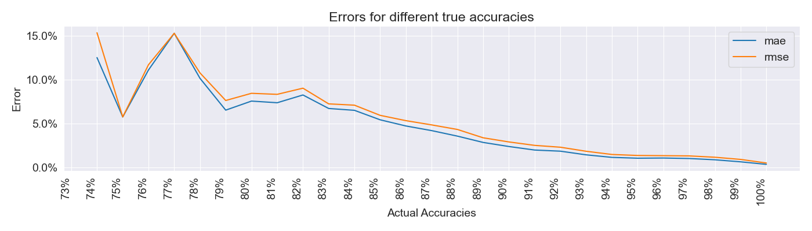

# :arrow_forward: [**Try Out Opal on Streamlit**](https://opal-ai.streamlit.app/)

# :comet: opal
opal is an accuracy-prediction model.

It uses Neural Collaborative Filtering to learn associations between user and maps, then using those associations to
predict new scores never before seen.

**Performance Error Graph**


## :hourglass_flowing_sand: Project Status

Currently, it's in its early access, that means, it'll have many problems!

However, we're working on it to minimize these issues o wo)b

## :arrow_double_down: Dataset Used

I used the top 10K mania users data from https://data.ppy.sh.
After preprocessing, we use
- ~10m scores for training
- ~1m scores for validation and testing each

After preprocessing, we found 29006 valid users, 12397 valid maps
This models can thus help predict >300m unplayed scores!

### Users
We deem a player on separate years as a different user. This is to reflect
the improvement of the player after time.

## :high_brightness: Usage

If you want to use this locally, you need Python and the packages listed in [requirements.txt](requirements.txt)

Below is a recipe on how to use it.
```py
path_to_model = MODEL_DIR / "V2_2023_01/checkpoints/epoch=5-step=43584.ckpt"
net = NeuMF.load_from_checkpoint(path_to_model.as_posix())

# THIS MUST BE RAN TO AVOID TRAINING THE MODEL
net.eval()

pred = net.predict('<USER_ID>/<YEAR>', '<MAP_ID>/<SPEED>')
preds = net.predict(['<USER_ID>/<YEAR>', '<USER_ID>/<YEAR>', ...],
                    ['<MAP_ID>/<SPEED>', '<MAP_ID>/<SPEED>', ...])
# <SPEED> must be -1, 0, or 1. Where -1 is half time, 0 is normal time, 1 is double time.

# E.g.
# Predict Evening on Year 2017, on the map Triumph & Regret [Regret] at Double Time
pred = net.predict('2193881/2017', '767046/1')

# Note that you can, and should predict in a list format, so it's a significantly faster.
# Note that the map and user id can be different!
preds = net.predict(['2193881/2017', '2193881/2018'], ['767046/1', '767046/0'])
```

## :brain: AlphaOsu!
Currently, opal doesn't provide recommendations, however, you can try out [AlphaOsu!](https://alphaosu.keytoix.vip/).
- [AlphaOsu! GitHub](https://github.com/AlphaOSU)
- [Support AlphaOsu!](https://alphaosu.keytoix.vip/support)

## Annex

### Why not Score Metric?
Score is not straightforward to calculate, and may be difficult to debug. Furthermore, score isn't of interest when
calculating performance points anymore.

[osu!mania ScoreV1 Reference](https://osu.ppy.sh/wiki/en/Gameplay/Score/ScoreV1/osu%21mania)
