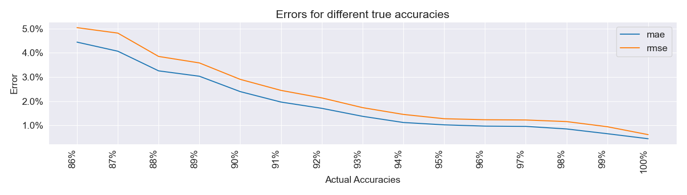

# [**Try Out Opal**](https://colab.research.google.com/drive/17WRYX24NJ4JaecJh8rUQ0iXSO93LrBUY?usp=sharing)

# opal
opal is an accuracy-prediction model.

It uses Neural Collaborative Filtering to learn associations between user and maps, then using those associations to
predict new scores never before seen.

**Performance Error Graph**

## Project Status

Currently, it's in its early access, that means, it'll have many problems!

However, we're working on it to minimize these issues o wo)b

## Dataset Used

I used the top 10K mania users data from https://data.ppy.sh.
After preprocessing, we use
- ~10m scores for training
- ~1m scores for validation and testing each

After preprocessing, we found 29006 valid users, 12397 valid maps
This models can thus help predict >300m unplayed scores!

### Users
We deem a player on separate years as a different user. This is to reflect
the improvement of the player after time.

## Usage

Currently, I'm only providing the solution as a **PyTorch Lightning Checkpoint**. 
That is, you **need** to use **Python** to use this!

I'm working on making the model more accurate before making the model UI through Streamlit.
So hang on tight!

## Why not Score Metric?
Score is not straightforward to calculate, and may be difficult to debug. Furthermore, score isn't of interest when
calculating performance points anymore.

[osu!mania ScoreV1 Reference](https://osu.ppy.sh/wiki/en/Gameplay/Score/ScoreV1/osu%21mania)
