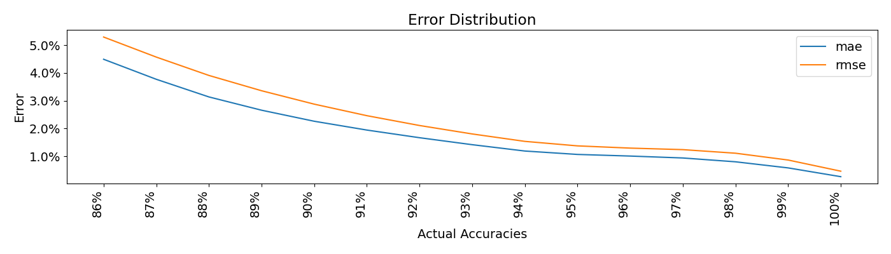

# Models

**See below on how to load the model.**

| Model       | R2     | MAE   | RMSE  |
|-------------|--------|-------|-------|
| V2_2023_01  | 81.48% | 1.18% | 1.71% |
| V2_2023_04  | 71.88% | 1.14% | 1.68% |
| V3_2023_05  | 73.76% | 1.09% | 1.62% |
| V4_2023_08  | 62.07% | 1.10% | 1.64% |
| V4_2023_09  | 60.17% | 1.15% | 1.71% |
| V5_2023_09b | 63.79% | 1.10% | 1.64% |

**Latest Error Distribution**


## Limitations

The model cannot ...

- predict maps not played by at least 50 players within the top 10k
- predict players not in the top 10k
- predict players who have not played at least 50 unique ranked maps in that year.
- predict maps with too many SVs

The predictive power (i.e. accuracy) is dependent on the number of players associated with each map.
Thus, these will be less accurate

- Half-time/Double-time maps
- Unpopular maps
- Players who play little

## Loading

```python
from opal import OpalNet

net = OpalNet.load()
USER_ID = 12345
YEAR = 2020
MAP_ID = 54321
SPEED = 0  # 0: Normal Time, -1: Half Time, 1: Double Time
pred_acc = net.predict(f"{USER_ID}/{YEAR}", f"{MAP_ID}/{SPEED}")
```

## History

### V1

V1 is the very first model deployed.

### V2

- Reduces model size such that it fits in a GitHub blob
- Decouples model from datamodule such that it's loadable separately

### V3

- Remove maps with high presence of SVs.
- Migrate datamodule to use MySQL database instead of csv.

### V4

- Fix issue with data leakage due to non-fixed split. (This tanks the accuracy significantly)
- V4 is the first model to be trained on a new automated pipeline.
- Substituted Matrix Factorization with a dot product of the user and map embeddings.
- Merged Embedding Space for both MLP and MF.

### V5
- Trained with new pipeline
